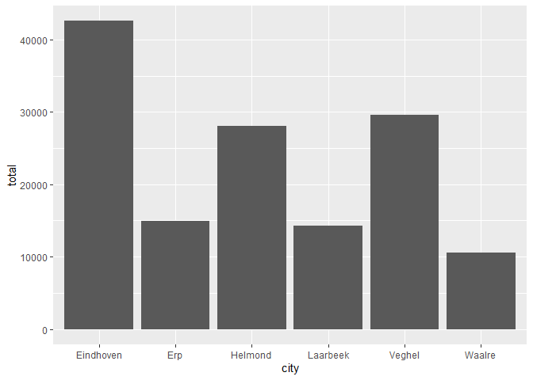

CustomerSales
================
ML
2023-04-14

In this notebook we conduct a simple analysis on a simple dataset of a
food retailer. The dataset consist of only a single table and is stores
in a csv file.

We will use the tidyverse to do the analysis. The tidyverse is a set of
packages created for exploratory data analysis.[R for Data
Science](https://r4ds.hadley.nz/) is an excellent beginners book to
study the tidyverse. In addition, all tidyverse packages have their own
documentation web sites. They all have the structure
<package name>.tidyverse.org, such as
[dplyr.tidyverse.org](dplyr.tidyverse.org).

We use [DuckDB](https://duckdb.org/) as an in-process relational
database. Although we don’t use it in this notebook, DuckDB enables to
load data directly from csv and Parquet files and compresses its tables
heavily. It is also much faster than dplyr, although you won’t notice
with the small dataset that we use.

If the packages won’t load, you have to install them using
`install.packages()`. Usuall Rstudio will ask you to install the
packages for you.

``` r
library(tidyverse)
```

    ## ── Attaching core tidyverse packages ──────────────────────── tidyverse 2.0.0 ──
    ## ✔ dplyr     1.1.1     ✔ readr     2.1.4
    ## ✔ forcats   1.0.0     ✔ stringr   1.5.0
    ## ✔ ggplot2   3.4.2     ✔ tibble    3.2.1
    ## ✔ lubridate 1.9.2     ✔ tidyr     1.3.0
    ## ✔ purrr     1.0.1     
    ## ── Conflicts ────────────────────────────────────────── tidyverse_conflicts() ──
    ## ✖ dplyr::filter() masks stats::filter()
    ## ✖ dplyr::lag()    masks stats::lag()
    ## ℹ Use the conflicted package (<http://conflicted.r-lib.org/>) to force all conflicts to become errors

``` r
library(duckdb)
```

    ## Loading required package: DBI

Read the dataset; select only the variables relevant for this analysis

``` r
sales <- read_csv('CustomerSales.csv', col_select = c(ordno, city, orddate, linetotal), col_types = "ccDd")
head(sales)
```

    ## # A tibble: 6 × 4
    ##   ordno city      orddate    linetotal
    ##   <chr> <chr>     <date>         <dbl>
    ## 1 1001  Veghel    2020-01-06     161. 
    ## 2 1002  Eindhoven 2020-01-07      85.5
    ## 3 1002  Eindhoven 2020-01-07     315  
    ## 4 1003  Helmond   2020-01-08     426. 
    ## 5 1004  Veghel    2020-01-14      52.5
    ## 6 1005  Helmond   2020-01-19     142.

We want to mirror our dplyr with SQL. To do so, we need the dataframes
we operate on with dplyr as tables in our SQL database. DuckDB is a
great match for such a database: it is in-memory, optimized for SQL
analysis queries and it enables using R dataframes as virtual tables in
its in-memory database. DuckDB’s SQL adheres to PostgreSQL’s SQL
dialect.

``` r
con <- DBI::dbConnect(drv = duckdb())
duckdb::duckdb_register(con, "sales", sales)
```

`duckdb::duckdb_register()` enables the use of the sales dataframe as a
virtual table. A virtual table here acts like an SQL view: you can
approach the virtual table as a common SQL table. DuckDB handles all
overhead.

#### What is the total sales in Eindhoven?

First we solve this in SQL:

``` sql
select sum(linetotal) as EindhovenSales
from sales
where city = 'Eindhoven'
```

<div class="knitsql-table">

| EindhovenSales |
|---------------:|
|       42603.21 |

1 records

</div>

This is how you solve it in dplyr. Though translation from dplyr to SQL
is much more interesting due to the higher expressiveness of dplyr, we
can define some simple rules for translating SQL to dplyr. Although
incomplete the set of rules below suffices for the simple queries we
start with.

- FROM: translates to just the dataframe (operation) at the top of the
  dplyr query;
- WHERE: translates to a `filter()` operation;
- GROUP BY: translates to either a `group_by()` operation, or a `.by`
  parameter in one of the dplyr operation supporting it;
- HAVING: translates to a `filter()` operation
- SELECT: translates to
  - a `select()` operation if we just use the name of a column;
  - a `mutate()` operation if we use an expression to create a new
    column;
  - a `summarise()` operation if we use an aggregation

[Here](https://medium.com/mlearning-ai/dplyr-vs-sql-c7277abc9482) you
can find a more comprehensive set of translation rules.

``` r
sales |> 
  filter(city == "Eindhoven") |> 
  summarise(EindhoveSales = sum(linetotal))
```

    ## # A tibble: 1 × 1
    ##   EindhoveSales
    ##           <dbl>
    ## 1        42603.

#### What is the total monthly sales in Eindhoven in 2022?

``` sql
select monthname(orddate) as month, sum(linetotal) as EindhovenSales
from sales
where city = 'Eindhoven' and year(orddate) = 2020
group by monthname(orddate)
```

<div class="knitsql-table">

| month     | EindhovenSales |
|:----------|---------------:|
| January   |        3679.48 |
| February  |        1760.01 |
| March     |        5040.15 |
| April     |         354.30 |
| May       |        1505.95 |
| June      |          75.00 |
| July      |        1232.15 |
| August    |         754.85 |
| September |        1112.90 |
| October   |        3094.47 |

Displaying records 1 - 10

</div>

Here is a straightforward translation of the SQL into dplyr.

``` r
sales |> 
  mutate(year = year(orddate), month = month(orddate, label = TRUE)) |> 
  filter(city == "Eindhoven", year == 2020) |> 
  group_by(month) |> 
  summarise(EindhoveSales = sum(linetotal))
```

    ## # A tibble: 12 × 2
    ##    month EindhoveSales
    ##    <ord>         <dbl>
    ##  1 Jan           3679.
    ##  2 Feb           1760.
    ##  3 Mar           5040.
    ##  4 Apr            354.
    ##  5 May           1506.
    ##  6 Jun             75 
    ##  7 Jul           1232.
    ##  8 Aug            755.
    ##  9 Sep           1113.
    ## 10 Oct           3094.
    ## 11 Nov            680.
    ## 12 Dec            471.

In dplyr we can combine we can use mutating expressions as parameters in
many operations:

``` r
sales |> 
  filter(city == "Eindhoven", year(orddate) == 2020) |> 
  group_by(city, month = month(orddate, label = TRUE)) |> 
  summarise(EindhoveSales = sum(linetotal))
```

    ## `summarise()` has grouped output by 'city'. You can override using the
    ## `.groups` argument.

    ## # A tibble: 12 × 3
    ## # Groups:   city [1]
    ##    city      month EindhoveSales
    ##    <chr>     <ord>         <dbl>
    ##  1 Eindhoven Jan           3679.
    ##  2 Eindhoven Feb           1760.
    ##  3 Eindhoven Mar           5040.
    ##  4 Eindhoven Apr            354.
    ##  5 Eindhoven May           1506.
    ##  6 Eindhoven Jun             75 
    ##  7 Eindhoven Jul           1232.
    ##  8 Eindhoven Aug            755.
    ##  9 Eindhoven Sep           1113.
    ## 10 Eindhoven Oct           3094.
    ## 11 Eindhoven Nov            680.
    ## 12 Eindhoven Dec            471.

Alternatively:

``` r
sales |> 
  group_by(city, year = year(orddate), month = month(orddate, label = TRUE)) |> 
  summarise(EindhoveSales = sum(linetotal)) |> 
  filter(city == "Eindhoven", year == 2020)
```

    ## `summarise()` has grouped output by 'city', 'year'. You can override using the
    ## `.groups` argument.

    ## # A tibble: 12 × 4
    ## # Groups:   city, year [1]
    ##    city       year month EindhoveSales
    ##    <chr>     <dbl> <ord>         <dbl>
    ##  1 Eindhoven  2020 Jan           3679.
    ##  2 Eindhoven  2020 Feb           1760.
    ##  3 Eindhoven  2020 Mar           5040.
    ##  4 Eindhoven  2020 Apr            354.
    ##  5 Eindhoven  2020 May           1506.
    ##  6 Eindhoven  2020 Jun             75 
    ##  7 Eindhoven  2020 Jul           1232.
    ##  8 Eindhoven  2020 Aug            755.
    ##  9 Eindhoven  2020 Sep           1113.
    ## 10 Eindhoven  2020 Oct           3094.
    ## 11 Eindhoven  2020 Nov            680.
    ## 12 Eindhoven  2020 Dec            471.

But this would have been an translation of a different, but alternative
SQL query. Note that the SQL query is more complex because the WHERE
clause always precedes the GROUP BY clause. In dplyr this strict order
is much more relaxed.

``` sql
select city, year, total
from (
  select city, year(orddate) as year, monthname(orddate) as month, sum(linetotal) as total
  from sales
  group by city, year(orddate), monthname(orddate)
)
where city = 'Eindhoven' and year = 2020
```

<div class="knitsql-table">

| city      | year |   total |
|:----------|-----:|--------:|
| Eindhoven | 2020 | 3679.48 |
| Eindhoven | 2020 | 1760.01 |
| Eindhoven | 2020 | 5040.15 |
| Eindhoven | 2020 |  354.30 |
| Eindhoven | 2020 | 1505.95 |
| Eindhoven | 2020 |   75.00 |
| Eindhoven | 2020 | 1232.15 |
| Eindhoven | 2020 |  754.85 |
| Eindhoven | 2020 | 1112.90 |
| Eindhoven | 2020 | 3094.47 |

Displaying records 1 - 10

</div>

We prefer common table expressions over inner queries because they are
more readable: top-to-bottom instead of inside-out.

``` sql
with cte as (
  select city, year(orddate) as year, monthname(orddate) as month, sum(linetotal) as total
  from sales
  group by city, year(orddate), monthname(orddate)
)
select city, year, total
from cte
where city = 'Eindhoven' and year = 2020
```

<div class="knitsql-table">

| city      | year |   total |
|:----------|-----:|--------:|
| Eindhoven | 2020 | 3679.48 |
| Eindhoven | 2020 | 1760.01 |
| Eindhoven | 2020 | 5040.15 |
| Eindhoven | 2020 |  354.30 |
| Eindhoven | 2020 | 1505.95 |
| Eindhoven | 2020 |   75.00 |
| Eindhoven | 2020 | 1232.15 |
| Eindhoven | 2020 |  754.85 |
| Eindhoven | 2020 | 1112.90 |
| Eindhoven | 2020 | 3094.47 |

Displaying records 1 - 10

</div>

#### What is the total sales for each city?

``` r
sales |> 
  group_by(city) |> 
  summarise(total = sum(linetotal))
```

    ## # A tibble: 6 × 2
    ##   city       total
    ##   <chr>      <dbl>
    ## 1 Eindhoven 42603.
    ## 2 Erp       14898.
    ## 3 Helmond   28056.
    ## 4 Laarbeek  14312.
    ## 5 Veghel    29652.
    ## 6 Waalre    10557.

We can also capture the resulting dataframe in a regular R variable:

``` r
res <- sales |> 
  group_by(city) |> 
  summarise(total = sum(linetotal))
res
```

    ## # A tibble: 6 × 2
    ##   city       total
    ##   <chr>      <dbl>
    ## 1 Eindhoven 42603.
    ## 2 Erp       14898.
    ## 3 Helmond   28056.
    ## 4 Laarbeek  14312.
    ## 5 Veghel    29652.
    ## 6 Waalre    10557.

We can use this captured result to visualise the dataframe with ggplot.
Note that ggplot uses `+` instead of `|>`.

``` r
ggplot(data = res, mapping = aes(x = city, y = total)) +
  geom_col()
```

<!-- -->

But we can also just chain along and pipe the result of the dplyr query
straight into ggplot.

``` r
sales |> 
  group_by(city) |> 
  summarise(total = sum(linetotal)) |> 
  ggplot(aes(city, total)) +
  geom_col()
```

<!-- -->

#### What is the total sales for each city, for each month, for each year?

``` r
sales |> 
  group_by(city, year = year(orddate), month = month(orddate, label = TRUE)) |> 
  summarise(total = sum(linetotal)) |> 
  pivot_wider(names_from = year, values_from = total)
```

    ## `summarise()` has grouped output by 'city', 'year'. You can override using the
    ## `.groups` argument.

    ## # A tibble: 71 × 5
    ## # Groups:   city [6]
    ##    city      month `2020` `2021` `2022`
    ##    <chr>     <ord>  <dbl>  <dbl>  <dbl>
    ##  1 Eindhoven Jan    3679.  1232.   794.
    ##  2 Eindhoven Feb    1760.  1356.   124.
    ##  3 Eindhoven Mar    5040.   580    656.
    ##  4 Eindhoven Apr     354.   928.   441.
    ##  5 Eindhoven May    1506.   446   1445 
    ##  6 Eindhoven Jun      75    895.    NA 
    ##  7 Eindhoven Jul    1232.  1683.  1219.
    ##  8 Eindhoven Aug     755.    66   2233.
    ##  9 Eindhoven Sep    1113.  1336.  1416.
    ## 10 Eindhoven Oct    3094.  1102.   314.
    ## # ℹ 61 more rows

Note the warning: `group_by()` creates a persistent grouping context. By
default `summarise()` peels off only the last element of the grouping
context. We can override this using the `.groups` parameter. It is
considered good style to be explicit and use the .`groups` parameter in
`summarise()` Here we want to get rid of the complete grouping context
and, hence, use `.groups = "drop`.

``` r
sales |> 
  group_by(city, year = year(orddate), month = month(orddate, label = TRUE)) |> 
  summarise(total = sum(linetotal), .groups = "drop") |> 
  pivot_wider(names_from = year, values_from = total)
```

    ## # A tibble: 71 × 5
    ##    city      month `2020` `2021` `2022`
    ##    <chr>     <ord>  <dbl>  <dbl>  <dbl>
    ##  1 Eindhoven Jan    3679.  1232.   794.
    ##  2 Eindhoven Feb    1760.  1356.   124.
    ##  3 Eindhoven Mar    5040.   580    656.
    ##  4 Eindhoven Apr     354.   928.   441.
    ##  5 Eindhoven May    1506.   446   1445 
    ##  6 Eindhoven Jun      75    895.    NA 
    ##  7 Eindhoven Jul    1232.  1683.  1219.
    ##  8 Eindhoven Aug     755.    66   2233.
    ##  9 Eindhoven Sep    1113.  1336.  1416.
    ## 10 Eindhoven Oct    3094.  1102.   314.
    ## # ℹ 61 more rows

What if we want proportional instead of absolute sales figures?

``` r
sales |> 
  group_by(city, year = year(orddate), month = month(orddate, label = TRUE)) |> 
  summarise(total = sum(linetotal), .groups = "drop_last") |>
  mutate(total = total/sum(total)) |> 
  pivot_wider(names_from = year, values_from = total)
```

    ## # A tibble: 71 × 5
    ## # Groups:   city [6]
    ##    city      month  `2020`  `2021`  `2022`
    ##    <chr>     <ord>   <dbl>   <dbl>   <dbl>
    ##  1 Eindhoven Jan   0.186   0.0983   0.0771
    ##  2 Eindhoven Feb   0.0891  0.108    0.0121
    ##  3 Eindhoven Mar   0.255   0.0463   0.0636
    ##  4 Eindhoven Apr   0.0179  0.0741   0.0428
    ##  5 Eindhoven May   0.0762  0.0356   0.140 
    ##  6 Eindhoven Jun   0.00380 0.0714  NA     
    ##  7 Eindhoven Jul   0.0624  0.134    0.118 
    ##  8 Eindhoven Aug   0.0382  0.00527  0.217 
    ##  9 Eindhoven Sep   0.0563  0.107    0.137 
    ## 10 Eindhoven Oct   0.157   0.0879   0.0304
    ## # ℹ 61 more rows

But to what whole does the proportion belong? Let’s do a quick test:

``` r
sales |> 
  group_by(city, year = year(orddate), month = month(orddate, label = TRUE)) |> 
  summarise(total = sum(linetotal), .groups = "drop_last") |>
  mutate(total = total/sum(total)) |> 
  pivot_wider(names_from = year, values_from = total) |> 
  group_by(city) |> 
  summarise(totprop = sum(`2020`, na.rm = TRUE))
```

    ## # A tibble: 6 × 2
    ##   city      totprop
    ##   <chr>       <dbl>
    ## 1 Eindhoven       1
    ## 2 Erp             1
    ## 3 Helmond         1
    ## 4 Laarbeek        1
    ## 5 Veghel          1
    ## 6 Waalre          1

Here the proportions are proportions of the yearly sales per city. What
the whole is, is determined by the grouping context in the mutate
expression. Remember that by default, the last element of the grouping
context is peeled off by the `summarise()`, so a grouping context of
city and year is left.

So, if you use persistent grouping, using `group_by()`, the order of
variables in the grouping context is critical.

``` r
sales |> 
  group_by(year = year(orddate), month = month(orddate, label = TRUE), city) |> 
  summarise(total = sum(linetotal), .groups = "drop_last") |>
  mutate(total = total/sum(total)) |> 
  pivot_wider(names_from = year, values_from = total)
```

    ## # A tibble: 71 × 5
    ## # Groups:   month [12]
    ##    month city      `2020` `2021`  `2022`
    ##    <ord> <chr>      <dbl>  <dbl>   <dbl>
    ##  1 Jan   Eindhoven 0.559   0.348  0.394 
    ##  2 Jan   Helmond   0.233   0.197  0.0799
    ##  3 Jan   Laarbeek  0.0273 NA      0.413 
    ##  4 Jan   Veghel    0.181   0.264  0.113 
    ##  5 Feb   Eindhoven 0.354   0.444  0.0740
    ##  6 Feb   Erp       0.135   0.126  0.264 
    ##  7 Feb   Helmond   0.258  NA     NA     
    ##  8 Feb   Veghel    0.253  NA      0.165 
    ##  9 Mar   Eindhoven 0.550   0.356  0.289 
    ## 10 Mar   Erp       0.168  NA     NA     
    ## # ℹ 61 more rows

If the persistent grouping list is confusing, you can switch to
per-operation grouping:

``` r
sales |> 
  mutate(year = year(orddate), month = month(orddate, label = TRUE)) |> 
  summarise(total = sum(linetotal), .by = c(year, month, city)) |>
  mutate(total = total/sum(total), .by = c(year, month)) |> 
  pivot_wider(names_from = year, values_from = total)
```

    ## # A tibble: 71 × 5
    ##    month city      `2020` `2021`  `2022`
    ##    <ord> <chr>      <dbl>  <dbl>   <dbl>
    ##  1 Jan   Veghel    0.181   0.264  0.113 
    ##  2 Jan   Eindhoven 0.559   0.348  0.394 
    ##  3 Jan   Helmond   0.233   0.197  0.0799
    ##  4 Jan   Laarbeek  0.0273 NA      0.413 
    ##  5 Feb   Veghel    0.253  NA      0.165 
    ##  6 Feb   Erp       0.135   0.126  0.264 
    ##  7 Feb   Eindhoven 0.354   0.444  0.0740
    ##  8 Feb   Helmond   0.258  NA     NA     
    ##  9 Mar   Eindhoven 0.550   0.356  0.289 
    ## 10 Mar   Veghel    0.199   0.397 NA     
    ## # ℹ 61 more rows

How do we translate this to SQL? In the old days we used either a
correlated subquery to calculate this:

``` sql
select year(orddate) as year, monthname(orddate) as month, city,
  sum(linetotal)/(
    select sum(linetotal)
    from sales s2
    where year(s2.orddate) = year(s1.orddate) and monthname(s2.orddate) = monthname(s1.orddate)
  ) as total
from sales s1
group by year, month, city
```

<div class="knitsql-table">

| year | month    | city      |     total |
|-----:|:---------|:----------|----------:|
| 2020 | January  | Veghel    | 0.1805817 |
| 2020 | January  | Eindhoven | 0.5592892 |
| 2020 | January  | Helmond   | 0.2328370 |
| 2020 | January  | Laarbeek  | 0.0272920 |
| 2020 | February | Veghel    | 0.2528571 |
| 2020 | February | Erp       | 0.1354261 |
| 2020 | February | Eindhoven | 0.3538733 |
| 2020 | February | Helmond   | 0.2578435 |
| 2020 | March    | Eindhoven | 0.5504012 |
| 2020 | March    | Veghel    | 0.1988156 |

Displaying records 1 - 10

</div>

Or a join with inline views, like this.

``` sql
with cityTotal as (
  select year(orddate) as year, monthname(orddate) as month, city, sum(linetotal) as ctotal
  from sales
  group by year, month, city
)
, ymTotal as (
  select year(orddate) as year, monthname(orddate) as month, sum(linetotal) as mtotal
  from sales
  group by year, month
)
select c.year, c.month, city, ctotal/mtotal as prop
from cityTotal c
join ymTotal m
  on c.year = m.year
  and c.month = m.month
```

<div class="knitsql-table">

| year | month    | city      |      prop |
|-----:|:---------|:----------|----------:|
| 2020 | January  | Veghel    | 0.1805817 |
| 2020 | January  | Eindhoven | 0.5592892 |
| 2020 | January  | Helmond   | 0.2328370 |
| 2020 | January  | Laarbeek  | 0.0272920 |
| 2020 | February | Veghel    | 0.2528571 |
| 2020 | February | Erp       | 0.1354261 |
| 2020 | February | Eindhoven | 0.3538733 |
| 2020 | February | Helmond   | 0.2578435 |
| 2020 | March    | Eindhoven | 0.5504012 |
| 2020 | March    | Veghel    | 0.1988156 |

Displaying records 1 - 10

</div>

Since the invention of windows function, about 15 years ago, solving
this problem has become a lot simpler.

``` sql
with cte as (
  select year(orddate) as year, monthname(orddate) as month, city, sum(linetotal) as total
  from sales
  group by year, month, city
)
select year, month, city, total/sum(total) over (partition by year, month) as total
from cte
```

<div class="knitsql-table">

| year | month | city      |     total |
|-----:|:------|:----------|----------:|
| 2020 | May   | Helmond   | 0.1232492 |
| 2020 | May   | Eindhoven | 0.5463051 |
| 2020 | May   | Erp       | 0.3304457 |
| 2021 | July  | Helmond   | 0.4298834 |
| 2021 | July  | Erp       | 0.0603769 |
| 2021 | July  | Eindhoven | 0.3815593 |
| 2021 | July  | Veghel    | 0.1023856 |
| 2021 | July  | Laarbeek  | 0.0257948 |
| 2022 | June  | Laarbeek  | 0.2100042 |
| 2022 | June  | Veghel    | 0.6215266 |

Displaying records 1 - 10

</div>

Although the use of window functions in SQL can be a bit intimidating at
first, they are really very powerful, especially with analysis queries.

We can do the windowing even in a single step. `sum(sum())` looks a bit
weird (and forbidden) at first, but once you get used to it, your
queries get a lot more compact.

``` sql
select year(orddate) as year, monthname(orddate) as month, city,
  sum(linetotal)/sum(sum(linetotal)) over (partition by year, month) as total
from sales
group by year, month, city
```

<div class="knitsql-table">

| year | month | city      |     total |
|-----:|:------|:----------|----------:|
| 2020 | May   | Helmond   | 0.1232492 |
| 2020 | May   | Eindhoven | 0.5463051 |
| 2020 | May   | Erp       | 0.3304457 |
| 2021 | July  | Helmond   | 0.4298834 |
| 2021 | July  | Erp       | 0.0603769 |
| 2021 | July  | Eindhoven | 0.3815593 |
| 2021 | July  | Veghel    | 0.1023856 |
| 2021 | July  | Laarbeek  | 0.0257948 |
| 2022 | June  | Laarbeek  | 0.2100042 |
| 2022 | June  | Veghel    | 0.6215266 |

Displaying records 1 - 10

</div>

#### How many lines have our orders?

``` r
sales |> 
  group_by(ordno) |> 
  summarise(nrLines = n()) |> 
  group_by(nrLines) |> 
  summarise(nrOrders = n())
```

    ## # A tibble: 6 × 2
    ##   nrLines nrOrders
    ##     <int>    <int>
    ## 1       1      387
    ## 2       2       27
    ## 3       3       14
    ## 4       4        9
    ## 5       5        1
    ## 6       6        1

A more idiomatic dplyr solution in this case would be:

``` r
sales |> 
  count(ordno, name = "nrLines") |> 
  count(nrLines, name = "nrOrders")
```

    ## # A tibble: 6 × 2
    ##   nrLines nrOrders
    ##     <int>    <int>
    ## 1       1      387
    ## 2       2       27
    ## 3       3       14
    ## 4       4        9
    ## 5       5        1
    ## 6       6        1

Since we are changing the group level along the query, we have to do
this in multiple steps in SQL. Although we could use a (nested) subquery
for this, we favor a common table expression as this is easier to read
(to-to-bottom instead of inside-out). Moreover, top-to-bottom evaluation
is the same approach we take in a piped query in dplyr.

``` sql
with cte as (
  select count(*) as nrLines
  from sales
  group by ordno
)
select nrLines, count(*) as nrOrders
from cte
group by nrLines
```

<div class="knitsql-table">

| nrLines | nrOrders |
|:--------|---------:|
| 1       |      387 |
| 2       |       27 |
| 3       |       14 |
| 4       |        9 |
| 5       |        1 |
| 6       |        1 |

6 records

</div>

#### What is for each year, for each weekday the number of weeks in which it was the day with the highest sales?

``` r
sales |> 
  group_by(
    yr = isoyear(orddate),
    wk = isoweek(orddate),
    wday = wday(orddate, label = TRUE, week_start = 1)
  ) |> 
  summarise(tot = sum(linetotal), .groups = "drop_last") |> 
  filter(rank(desc(tot)) == 1) |> 
  ungroup() |> 
  count(yr, wday)
```

    ## # A tibble: 21 × 3
    ##       yr wday      n
    ##    <dbl> <ord> <int>
    ##  1  2020 Mon       9
    ##  2  2020 Tue       9
    ##  3  2020 Wed       5
    ##  4  2020 Thu       8
    ##  5  2020 Fri       3
    ##  6  2020 Sat       8
    ##  7  2020 Sun       7
    ##  8  2021 Mon       4
    ##  9  2021 Tue       7
    ## 10  2021 Wed      11
    ## # ℹ 11 more rows

``` sql
with cte as (
  select
    isoyear(orddate) as yr,
    week(orddate) as wk,
    dayname(orddate) as wday,
    isodow(orddate) as dynr,
    sum(linetotal) as tot,
    rank() over (partition by yr, wk order by tot desc) as rnk
  from sales
  group by yr, wk, wday, dynr
)
select yr, wday, count(*) as n
from cte
where rnk = 1
group by yr, wday, dynr
order by yr, dynr
```

<div class="knitsql-table">

|   yr | wday      |   n |
|-----:|:----------|----:|
| 2020 | Monday    |   9 |
| 2020 | Tuesday   |   9 |
| 2020 | Wednesday |   5 |
| 2020 | Thursday  |   8 |
| 2020 | Friday    |   3 |
| 2020 | Saturday  |   8 |
| 2020 | Sunday    |   7 |
| 2021 | Monday    |   4 |
| 2021 | Tuesday   |   7 |
| 2021 | Wednesday |  11 |

Displaying records 1 - 10

</div>

One of the shortcomings of SQL is that window functions can only be used
in select and, less common, order by clauses. That means that when we
want to filter or group on a window function value, we always have to
use a subquery to calculate the window function value.

``` r
DBI::dbDisconnect(conn = con, shutdown = TRUE)
```
